# AI Study Hub — Full Project Report (English)

> Preparation document for your discussion/defense: summarizes the project idea, architecture,
> all features, the audit & fixes, and the AI chat integration — so you can confidently answer
> **"What did you do in this project?"**

---

## 1) Project Idea (Elevator Pitch)

**AI Study Hub** is a study-management web app. A student signs up, sees a **dashboard** with
stats and charts, organizes their **tasks** (Study Planner), **notes**, and **learning resources**,
and chats with a built-in **AI Study Assistant** that explains concepts, answers study questions,
and helps build study plans.

Built with **Django (MVT) + PostgreSQL**, no REST Framework, and no frontend framework —
the UI is **Django Templates + HTML/CSS/Vanilla JavaScript**.

---

## 2) Tech Stack

| Technology | Purpose |
|---|---|
| Python 3.12 | Programming language |
| Django 5.1 (MVT) | Core framework (Models / Views / Templates) |
| PostgreSQL | Main database |
| django-environ | Reads sensitive settings from `.env` |
| requests | HTTP client for the AI provider |
| reportlab | Export notes to PDF |
| Pillow | Image uploads (profile picture) |
| Chart.js (CDN) | Dashboard charts |
| HTML / CSS / JS | Frontend (no framework) |

---

## 3) Project Structure

```
Project/
├── manage.py
├── requirements.txt
├── .env.example          # copy to .env (secrets never hard-coded)
├── config/               # project settings + root urls + error handlers
├── core/                 # landing page + ActivityLog + context processor + error views
├── accounts/             # register/login/profile/email verification/password reset
├── dashboard/            # stats page + Chart.js charts
├── planner/              # Tasks + TaskCategory (full CRUD)
├── notes/                # Notes + live search + PDF export
├── resources/            # Learning resources + safe external links
├── ai_assistant/         # Conversations + Messages + isolated AI service layer
├── templates/            # all HTML + error pages (403/404/500)
├── static/               # CSS + JS (charts / chat / notes-search)
├── media/                # uploaded images (git-ignored)
└── docs/                 # documentation (this report)
```

Every app keeps a clean split: `models.py / forms.py / views.py / urls.py / admin.py`.
All AI provider logic lives only in `ai_assistant/services.py`.

---

## 4) Database Schema (Models)

| App | Model | Key fields |
|---|---|---|
| accounts | `Profile` | full_name, bio, profile_picture, date_of_birth, phone, location |
| accounts | `EmailVerification` | token, is_verified, expires_at |
| accounts | `PasswordResetToken` | token, is_used, expires_at |
| core | `ActivityLog` | user, action, content_type, description, created_at |
| planner | `Task` | title, description, due_date, priority, status, is_completed |
| planner | `TaskCategory` | name (per user) |
| notes | `Note` | title, content, image, categories (M2M) |
| notes | `NoteCategory` | name (per user) |
| resources | `Resource` | title, description, link, resource_type, thumbnail |
| resources | `ResourceCategory` | name (per user) |
| ai_assistant | `Conversation` | title, user |
| ai_assistant | `Message` | sender (user/assistant), message, conversation (FK) |

---

## 5) Entity Relationship Diagram (ERD)

### 5.1 Mermaid diagram (renders on GitHub / GitLab / VS Code)

```mermaid
erDiagram
    %% ─── Django built-in ───
    auth_user ||--o| accounts_profile            : "user (OneToOne, related_name='profile')"
    auth_user ||--o{ accounts_emailverification  : "email_verifications"
    auth_user ||--o{ accounts_passwordresettoken : "password_reset_tokens"

    %% ─── core ───
    auth_user ||--o{ core_activitylog            : "activity_logs"

    %% ─── planner ───
    auth_user ||--o{ planner_task                : "tasks"
    auth_user ||--o{ planner_taskcategory        : "task_categories"
    planner_task ||--o{ planner_task_categories  : "categories (M2M junction)"
    planner_taskcategory ||--o{ planner_task_categories : "categories (M2M junction)"

    %% ─── notes ───
    auth_user ||--o{ notes_note                  : "notes"
    auth_user ||--o{ notes_notecategory          : "note_categories"
    notes_note ||--o{ notes_note_categories      : "categories (M2M junction)"
    notes_notecategory ||--o{ notes_note_categories : "categories (M2M junction)"

    %% ─── resources ───
    auth_user ||--o{ resources_resource          : "resources"
    auth_user ||--o{ resources_resourcecategory  : "resource_categories"
    resources_resource ||--o{ resources_resource_categories : "categories (M2M junction)"
    resources_resourcecategory ||--o{ resources_resource_categories : "categories (M2M junction)"

    %% ─── ai_assistant ───
    auth_user ||--o{ ai_assistant_conversation   : "conversations"
    ai_assistant_conversation ||--o{ ai_assistant_message : "messages"
```



**Legend:** `||--o{` = one-to-many (FK), `||--o|` = one-to-one, `}o--o{` = many-to-many.

### 5.2 Plain-text version (for editors that don't render Mermaid)

```
                        ┌────────────────────────────────────────────────────────┐
                        │                     auth_user (Django)                 │
                        └──────┬──────────┬──────────┬──────────┬───────────────┘
          OneToOne              │          │          │          │
        ┌───────────────────────┘          │          │          │
        │                                  │          │          │
        ▼                                  ▼          ▼          ▼
┌──────────────┐   ┌─────────────────────┐   ┌─────────────┐  ┌──────────────┐
│    Profile   │   │ EmailVerification   │   │ PasswordReset│  │ ActivityLog │
│ (1 user → 1) │   │ (1 user → many)     │   │ Token (1→many)│ │ (1 user→many)│
└──────────────┘   └─────────────────────┘   └─────────────┘  └──────────────┘

  auth_user 1 ──┬── many Task ◄──M2M──► TaskCategory          (planner)
                ├── many Note ◄──M2M──► NoteCategory          (notes)
                └── many Resource ◄──M2M► ResourceCategory    (resources)
                        (junction tables: planner_task_categories,
                         notes_note_categories, resources_resource_categories)

  auth_user 1 ── many Conversation ── many Message            (ai_assistant)
```

### 5.3 Relationship summary

| From | To | Type | Cardinality | related_name |
|---|---|---|---|---|
| `auth_user` | `Profile` | OneToOne | 1 : 1 | `profile` |
| `auth_user` | `EmailVerification` | FK | 1 : N | `email_verifications` |
| `auth_user` | `PasswordResetToken` | FK | 1 : N | `password_reset_tokens` |
| `auth_user` | `ActivityLog` | FK | 1 : N | `activity_logs` |
| `auth_user` | `Task` | FK | 1 : N | `tasks` |
| `auth_user` | `TaskCategory` | FK | 1 : N | `task_categories` |
| `Task` | `TaskCategory` | M2M | N : N | `tasks` (on Category) |
| `auth_user` | `Note` | FK | 1 : N | `notes` |
| `auth_user` | `NoteCategory` | FK | 1 : N | `note_categories` |
| `Note` | `NoteCategory` | M2M | N : N | `notes` (on Category) |
| `auth_user` | `Resource` | FK | 1 : N | `resources` |
| `auth_user` | `ResourceCategory` | FK | 1 : N | `resource_categories` |
| `Resource` | `ResourceCategory` | M2M | N : N | `resources` (on Category) |
| `auth_user` | `Conversation` | FK | 1 : N | `conversations` |
| `Conversation` | `Message` | FK | 1 : N | `messages` |

**Key talking points for the ERD:**
- **Everything hangs off the user** — every table has a `user` FK (or reaches one through it).
  This is what enforces **per-user data isolation** at the schema level.
- Categories are **M2M** (`Task ↔ TaskCategory`, etc.) so one task can have many categories and
  one category can hold many tasks, via hidden junction tables Django creates automatically.
- The **chat** is a simple parent/child chain: `User → Conversation → Message`.

---

## 6) Features in Detail

### 🔐 Authentication (accounts)
- Register / Login / Logout
- Profile page with image upload + update info
- Change password
- **Email verification** (token + expiry)
- **Password reset** (token)
- Verification/reset links are printed to the terminal (console email backend) in dev

### 📊 Dashboard
- Stats cards: total / completed / pending tasks, total notes, total resources
- **Chart.js charts**: completed vs pending, tasks by priority, notes by category
- Recent activity feed (ActivityLog)
- Quick actions (add task / note / resource, open the AI assistant)

### 🗓️ Study Planner (tasks) — full CRUD
- Create / edit / view / delete + mark complete/uncomplete
- Priority (Low/Medium/High) + categories (M2M) + due date
- Filtering by status, priority, category + pagination

### 📝 Notes — full CRUD
- JavaScript **live search** across title + content
- Filter by category + pagination
- **PDF export** of the user's notes (reportlab)

### 🔗 Learning Resources — full CRUD
- Resource type (Article/Video/Documentation/Course/Book/Other)
- External link + **safe handling** (open in new tab, URL validation)
- Filtering + pagination

### 🤖 AI Chat Assistant (`/ai-chat/`)
- Modern chat UI: multiple conversations per user, user/AI bubbles, loading + error states
- **Per-user isolation** — you only see your own conversations
- Isolated **service layer** (`ai_assistant/services.py`) — all provider I/O lives there
- Optional **study-data context**: the AI receives a summary of the user's *own* data
  (pending tasks with due dates, recent notes) via `context.py`
  → e.g. "Which tasks are due this week?" works against real data
- Works with **any OpenAI-compatible provider** (OpenAI, Groq, OpenRouter, local, …)
- **Offline fallback** when no API key is set, so the chat never breaks during development

### 🎨 Other
- Dark mode toggle (persisted in `localStorage`)
- Responsive design (mobile → desktop)
- Friendly 403 / 404 / 500 error pages
- Django admin for all models
- Security: CSRF, auth checks, per-user querysets, secrets via env vars

---

## 7) ⭐ The Audit — 9 Issues Found & Fixed

The project went through a **full project audit**. Root cause was determined *before* each fix,
and all fixes preserved the architecture and intended behavior (no feature was removed).

### [A] Production-breaking bugs
1. **Broken error pages** — `core/views.py` pointed to `errors/404.html / 403.html / 500.html`
   which **do not exist**; the real templates live at `templates/{404,403,500}.html`. With
   `DEBUG=False`, any error cascaded into a `TemplateDoesNotExist`. ✅ **Fix:** corrected the
   template names in `core/views.py`.

2. **`templates/notes/note_list.html`** used `` inside the `extra_js` block
   **without ``** → `/notes/` raised a 500. ✅ **Fix:** added ``.
   (Lesson: `manage.py check` does NOT catch this — you must actually render the page.)

### [B] Functional bugs
3. **Dashboard charts always empty** — `dashboard/views.py` emitted **nested** JSON while
   `charts.js` reads **flat** keys (`completed_tasks`, `pending_tasks`,
   `priority_low/medium/high`, `notes_categories`…). Every chart showed "No data yet."
   ✅ **Fix:** unified `dashboard/views.py` to emit the flat keys `charts.js` expects.

4. **AI chat history** excluded **every** past message whose text matched the new one, instead
   of only the just-created message → repeating a question silently dropped older duplicates
   from the AI context. ✅ **Fix:** exclude by the new message's **pk** in `ai_assistant/views.py`.

5. **`smoke_test.py`** — `django.test.Client` sends host `testserver`, which wasn't in
   `ALLOWED_HOSTS` (every request → 400); plus two wrong URLs (`/export/notes/pdf/` vs the real
   `/notes/export/pdf/`, and `/ai-chat/new/send/` vs the real `/ai-chat/send/`).
   ✅ **Fix:** appended `testserver` to `ALLOWED_HOSTS` + corrected the URLs.

### [C] Security issues
6. **Open redirect on login** — the `?next=` parameter was passed straight to `redirect()`
   (verified: `?next=https://evil.example.com` followed the external site after login).
   ✅ **Fix:** added an open-redirect guard in `accounts/views.py` that only accepts
   internal paths.

7. **Stored XSS in the dashboard** — `{{ charts_json|safe }}` inside a `<script>` block: a
   category name like `</script><script>…` could break out of the JSON.
   ✅ **Fix:** switched to Django's `json_script` filter in `templates/dashboard/home.html`.

### [D] Minor issues
8. **Conflicting DEBUG defaults** in `config/settings.py` (`environ.Env(DEBUG=(bool, False))`
   vs `env.bool("DEBUG", default=True)`) — a missing `.env` would run the app in dev mode.
   ✅ **Fix:** `DEBUG` now defaults to `False`.

9. **Broken default avatar** — `Profile.image_url` referenced
   `/static/images/default-avatar.svg` which didn't exist. ✅ **Fix:** created the SVG asset.

### Files changed (8 modified + 1 new)
```
core/views.py                  → corrected error-template names
templates/notes/note_list.html → added 
dashboard/views.py             → flat chart keys matching charts.js
templates/dashboard/home.html  → json_script (XSS-safe data)
ai_assistant/views.py          → exclude message by pk
accounts/views.py              → open-redirect guard on ?next=
config/settings.py             → DEBUG now defaults to False
smoke_test.py                  → allow testserver host + fixed URLs
static/images/default-avatar.svg  (NEW)
```

### Commands / tests executed
- `python manage.py check` → clean (0 issues)
- `python manage.py makemigrations --check --dry-run` → no pending changes
- `python manage.py test` → 0 tests ran (all `tests.py` are placeholders)
- `python smoke_test.py` → all pages 200, PDF → `application/pdf`, AI send → `application/json`
- **Manual functional test:** full CRUD for tasks/notes/resources + per-user isolation
  (cross-user access correctly returns 404)
- **Production-mode (DEBUG=False) verification:** 403/404/500 pages render, open-redirect
  guard blocks external `?next=`, chart JSON has the expected flat keys

---

## 8) Connecting the AI Chat to Groq (latest addition)

The chat was running in **offline fallback** mode (canned replies) because no API key was set.
Most recent work:
- Added a **Groq API key** in `.env` (Groq = free, fast, OpenAI-compatible)
- `AI_API_BASE_URL=https://api.groq.com/openai/v1`
- `AI_MODEL=llama-3.3-70b-versatile` (strongest free model on Groq)
- **Verified with a real request** — Groq returned a valid reply (`hello from groq`) ✅
- Server restarted to pick up the new settings

Result: the chat now returns **real intelligent answers** instead of canned fallback replies.

---

## 9) Remaining Issues (non-blocking — good discussion points)

1. **No automated tests** — every `tests.py` is a placeholder ("Ran 0 tests")
2. `docs/` was empty while the README references `docs/erd.png` and
   `docs/ai_study_hub_backup.sql` (nothing fabricated)
3. `templates/includes/pagination.html` is unused dead code (templates inline their own)
4. `Resource.thumbnail` exists in the model + form but isn't rendered in the templates
5. Profile-image validation only checks size (README claims type + size)
6. `.env` holds dev-only `SECRET_KEY` / DB password (git-ignored) — rotate before any real
   deployment

---

## 10) How to Run

```bash
source venv/bin/activate
python manage.py runserver
```

Open http://127.0.0.1:8000/
- `/` → register/login → `/dashboard/`
- Chat: `/ai-chat/`
- Admin: `/admin/`

Prerequisites: PostgreSQL running + an `ai_study_hub` database + a `.env` file.

---

## 11) Expected Discussion Questions + Answers

**Q: Why Django without DRF?**
A: This is an MVT training project — nothing needs a REST API. Pages are server-rendered with
Django Templates, and the one AJAX flow (chat) returns plain JSON.

**Q: How did you guarantee user-data security?**
A: Every model has a `user` FK (or reaches one through it) and every view filters by
`request.user`, so no queryset can leak across users. After the audit we also closed an
**open-redirect** in login and a **stored-XSS** in the dashboard.

**Q: How does the chat work?**
A: An isolated service layer (`services.py`) talks to any OpenAI-compatible endpoint. If no API
key is set it falls back to offline canned replies so the feature keeps working in dev. It also
sends the user's *own* study data as context (e.g. pending tasks) when relevant.

**Q: What was the hardest part?**
A: The security fixes — the stored-XSS and the open-redirect — required real understanding of
attack vectors. Also the JSON/charts mismatch that silently kept every dashboard chart empty.

**Q: Future plans?**
A: Add automated tests, render `Resource.thumbnail`, switch email to real SMTP, and make the AI
context richer.

---

*Report generated on 2026-08-10 — up to date with the latest project work (audit + 9 fixes + Groq integration).*
